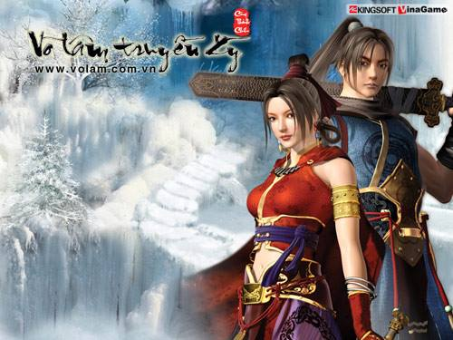
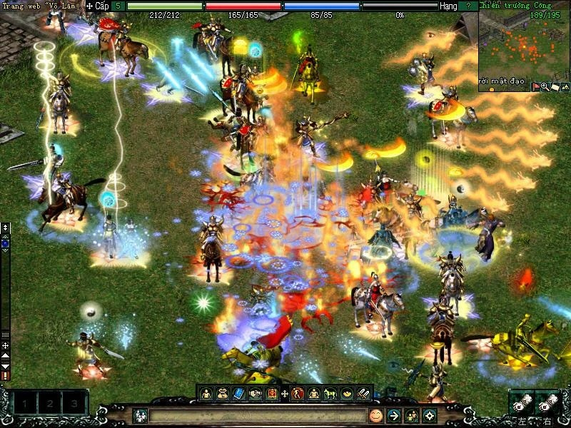
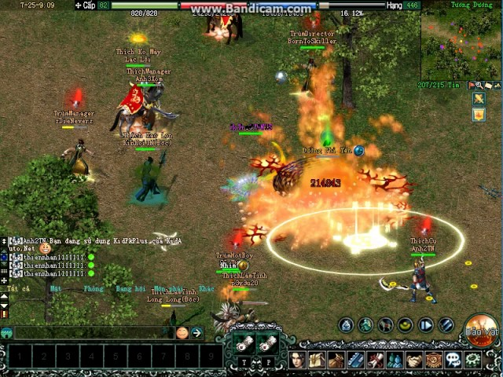
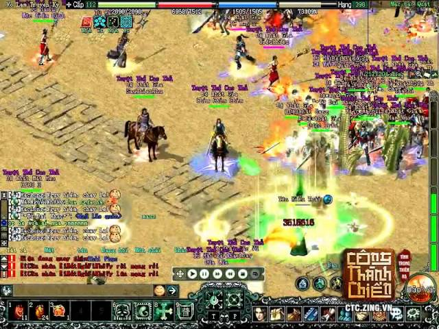

# JX DOCUMENTATION - Jianxia Qingyuan

	

	
	

## :rocket: I. Giới thiệu dự án

Dự án **"JX DOCUMENTATION"** của tui là nơi **tổng hợp, lưu giữ kiến thức kỹ thuật và sự sáng tạo**, giúp bạn thấu hiểu cách xây dựng và tạo ra trải nghiệm game độc đáo dựa trên dòng trò chơi kiếm hiệp phong cách Á Đông.

Dự án của tui bao gồm tài liệu hướng dẫn chi tiết, ví dụ thực tế, và các bước thực hiện cụ thể để bạn có thể bắt đầu tạo ra những trò chơi JX riêng của mình. Chúng tôi sẽ giúp bạn tạo ra các môi trường game, kỹ năng chiến đấu, hệ thống nhiệm vụ, và nhiều yếu tố thú vị khác.

Mục tiêu là giúp cộng đồng lập trình (Jx Dev/Lua Dev) và yêu thích trò chơi kiếm hiệp JX trên khắp thế giới phát triển kỹ năng lập trình và thúc đẩy sự sáng tạo trong ngành game phát triển. Dự án "JX DOCUMENTATION" sẽ đưa bạn vào cuộc hành trình thú vị để biến ước mơ làm game thành hiện thực.

## :diamond_shape_with_a_dot_inside: II. Định nghĩa & nguồn gốc Game JX

> **Game JX** thường là viết tắt của **"Jianxia Qingyuan"** hoặc **"Jian Xia Qing Yuan"** (chữ Hán: 剑侠情缘, tiếng Anh: SWORDSMAN Online), và nó thường được dịch là **"Kiếm Hiệp Tình Duyên"** là một dòng trò chơi trực tuyến nhiều người chơi (MMORPG) phát triển bởi công ty Kingsoft (Kim Sơn) từ Trung Quốc và được VNG phân phối tại Việt Nam. Trò chơi cho phép các người chơi đóng vai dựa theo các tiểu thuyết kiếm hiệp của Trung Quốc. Trò chơi này từng gây cơn sốt ở Trung Quốc và được Hiệp hội Phần mềm Trung Quốc trao giải "Trò chơi xuất sắc nhất năm 2003".

  

### **1. Lịch sử và Phát triển**

Sau khi được Việt hóa giao diện và chuẩn bị các điều kiện cần thiết, trò chơi đã chính thức ra mắt người chơi Việt Nam vào ngày 21 tháng 3 năm 2005. Game đã thu hút được đông đảo người chơi từ rất nhiều ngành nghề: bác sĩ, giáo sư, giáo viên, học sinh, công nhân viên chức, nghệ sĩ nổi tiếng như: Ưng Hoàng Phúc, Tấn Beo, Lam Trường, Xuân Bắc, Ngân Khánh, …. Từ khi ra mắt năm 2005 đến thời điểm cập nhật 04/2014, VLTK đã có tổng cộng gần 20tr người chơi với 86 server trong một thời điểm

Một trong những hoạt động tầm cỡ, nổi bật nhất của Võ Lâm Truyền Kỳ là Đại hội Võ Lâm với sự tham gia của hơn 40.000 người vào năm 2005 tại nhà thi đấu Quân khu 7.

Ngoài các hoạt động trong game, Võ Lâm Truyền Kỳ còn tổ chức thành công cuộc thi Thập Đại Mỹ Nhân và các mỹ nhân đó hiện đang là những nhân vật nổi tiếng như ca sĩ Bảo Thy, diễn viên Ngân Khánh, ca sĩ Bích Ly, hoa hậu Ngọc Hân…

  

### **2. Thế giới và Nội dung**

Trò chơi thường xoay quanh thế giới kiếm hiệp và những thời kỳ lịch sử phong kiến của Trung Quốc.

  

Người chơi thường có cơ hội tạo và tùy chỉnh nhân vật, khám phá thế giới ảo, tham gia vào các cuộc phiêu lưu, chinh phạt boss, thực hiện nhiệm vụ, và thu thập vũ khí, trang bị, và kỹ năng.

  

:arrow_right: **Thập Đại Môn Phái:**

Nét đặc sắc của trò chơi phụ thuộc vào yếu tố ngũ hành tương sinh - tương khắc. Thập đại môn phái vì thế được phân chia theo 5 hành: **Kim, Mộc, Thủy, Hỏa, Thổ**. Năm 2014, VLTK1 được cập nhật phiên bản mới Nơi Ta Thuộc Về, trong phiên bản này xuất hiện thêm 1 môn phái mới, nâng tổng số môn phái thành 11:

:small_red_triangle_down: **Hệ Kim:**

- Thiếu Lâm tự - 소림사 (少林寺)
- Thiên Vương bang - 천왕방 (天王幫)
- Dương Môn

:small_red_triangle_down: **Hệ Mộc:**

- Ngũ Độc giáo - 오독교
- Đường môn - 당문

:small_red_triangle_down: **Hệ Thủy:**

- Nga My - 아미파 (峨嵋派)
- Thúy Yên môn - 취연문 (翠煙)
- Hoa Sơn phái - 화산파 (華山派)

:small_red_triangle_down: **Hệ Hỏa:**

- Cái bang - 개방 (丐幫)
- Thiên Nhẫn giáo

:small_red_triangle_down: **Hệ Thổ:**

- Côn Lôn phái - 곤륜파 (崑崙派)
- Võ Đang phái - 무당파 (武当派)

:arrow_right: **Các giải đấu:**

- Thiên Hạ Đệ Nhất Bang là tên một giải đấu nổi tiếng của game Võ Lâm Truyền Kỳ do công ty VNG phát hành. Giải đấu thường được tổ chức định kì 6 tháng một lần với giải thưởng là tiền mặt và những vật phẩm có giá trị trong game. Các máy chủ sẽ chọn ra một bang hội đại diện tham gia vào giải đấu. Hiện tại, Thiên Hạ Đệ Nhất Bang được chia ra làm 3 giải, trong đó bao gồm giải đấu cho phiên bản Mobile của Võ Lâm Truyền Kỳ 1 và 2 giải đấu song song cho 2 phiên bản PC của Võ Lâm Truyền Kỳ là phiên bản thu phí và phiên bản miễn phí.

### **3. Phiên bản và Cập nhật**

:arrow_right: Võ Lâm Truyền Kỳ Việt Nam đã trải qua 11 phiên bản chính thức

- Phiên bản thứ 1 Công Thành Chiến (2005)
- Phiên bản thứ 2 Sơn Hà Xã Tắc
- Phiên bản thứ 3 Tình Nghĩa Giang Hồ
- Phiên bản thứ 4 Phong Hỏa Liên Thành
- Phiên bản thứ 5 Hùng Bá Thiên Hạ
- phiên bản thứ 6 Thất Thành Đại Chiến
- Phiên bản thứ 7 Phong Vân Tái Khởi
- Phiên bản thứ 8 Bát Mạch Chân Kinh
- Phiên bản thứ 9 Cửu Niên Trùng Phùng
- Phiên bản thứ 10 Nơi Ta Thuộc Về (2015)
- Và trong năm 2015 ra mắt Phiên Bản thứ 11 Tụ Nghĩa Vi Minh

:arrow_right: Ngoài ra, còn có các phiên bản mà các game thủ hay gọi như:

- Phiên bản 6.0 đồ xanh hiếm CTC 2005
- Phiên bản 6.0 đồ xanh, ép đồ tím CTC 2005
- Phiên bản 6.0 AB, ĐQ, HKMP
- Phiên bản 6.0 HKMP 150 siêu nhân (Thanh Câu, Bạch Hổ, Hắc Thần...)
- Phiên bản 8.0 (Siêu nhân, đồ thiên mệnh, anh hào, ngựa mới...)

:arrow_right: phiên bản theo hệ kỹ năng:

- Phiên bản thân pháp (chuẩn thân pháp Đường môn), skill 90, 120 làm chủ đạo
- Phiên bản nội công (Đường môn, Ngũ Độc tăng nội công nổ damge) skill 90, 120 làm chủ đạo
- Phiên bản full phái ngoại công (tăng nội công ko lên lực tay) hỗ trợ tới 90, 120 ,150, 180
- Phiên bản siêu nhân kỹ năng mới, phái mới, hiệu ứng mới (đẩy lùi, khoá nhân vật...)

### **4. Cộng đồng và Tương tác Xã hội**

:point_right: [Hội quán Võ Lâm Offline](https://www.facebook.com/groups/volamquan/): Đây là nơi thảo luận, chia sẻ các kỹ thuật, trải nghiệm game VLTK offline phiên bản do hội quán phát triển.

:point_right:  [Cộng đồng PYTA Gaming](https://www.facebook.com/groups/pytagaming1/): cộng đồng về kỹ thuật, game offline 

:point_right:  [jxdocs.com](https://www.facebook.com/groups/jxdocs) : cộng đồng về kỹ thuật, game offline 

:point_right: [Diễn đàn Clbgamesvn Võ Lâm Truyền Kỳ (Jx Server)](https://www.clbgamesvn.com/diendan/forumdisplay.php?f=494) : cộng đồng về kỹ thuật, game offline.

### **5. Các trang web về game JX của Kingsoft & VNG**

Kiếm Hiệp 1 (剑网1) [https://jx.xoyo.com/](https://l.facebook.com/l.php?u=https%3A%2F%2Fjx.xoyo.com%2F%3Ffbclid%3DIwAR2QUpvarytKcEBeJdqkogYhkLxdx1DvGGfZl7RO9ygHXEEwyRnw3a7yb9A&h=AT0TVRsBlNS8XAI4NCUHa55sXZ-G66JSJsKE8J5MwOawHdT9HxtadX5ZFyuu7sqzZ9fQ_9_NjxDGd5BD35wY26IndHixV3uwPcDDxlfNq-NsBbsLriNMWIj9XJhDqgpf1eF3xuh5LNd1bTd6RUQU&__tn__=-UK-R&c[0]=AT1TsS26b4UxACPpfCLruMBYEY8vQ0uxHazvuHWjrJSsLhFMDkDR9Oc1TDv6D1sgwBR-WztVY55fq2tN8tpd6g-9lq-NborUkr-HUNpUX04delI9h25bHMy_79bV2lYmeFZ6zsmzTNZf2o9jVUcHE9OxekmPqucw3oA_1h0) - Võ Lâm Truyền Kỳ [https://volam.zing.vn/](https://l.facebook.com/l.php?u=https%3A%2F%2Fvolam.zing.vn%2F%3Ffbclid%3DIwAR1WdEwXhdJPMq4eQYXZp4BNbQNNS4BNbOVAc8d585CuczrnBJqxK6cenyU&h=AT2KiL1C1JM1Xg4u38FakyAOXoWAt2_wHndxH3BZO8g9JEkQzq80ifEG60oRjSjl0h6AeR4WjyiucUgAQYacYM9ehPAON1DIM3Yr-2uPWzOXGsfJIV3rT059R00iHqjrGaxwLT0DoLu2y5vI1VK2&__tn__=-UK-R&c[0]=AT1TsS26b4UxACPpfCLruMBYEY8vQ0uxHazvuHWjrJSsLhFMDkDR9Oc1TDv6D1sgwBR-WztVY55fq2tN8tpd6g-9lq-NborUkr-HUNpUX04delI9h25bHMy_79bV2lYmeFZ6zsmzTNZf2o9jVUcHE9OxekmPqucw3oA_1h0)

Kiếm Hiệp 2 (剑网2) [https://jx2.xoyo.com/](https://l.facebook.com/l.php?u=https%3A%2F%2Fjx2.xoyo.com%2F%3Ffbclid%3DIwAR0HTyV2WQEdZMzkgsbZ6SFYoR9ymWabZsIqVRfmHtklZb5LBFiX4WL72Vk&h=AT3UYSyXUZQOfjhift6DYJ8aHfijI3qlhAC2yQAHfWNBeCn0gUOvHaLgFAFMCXaPejj7pk3l_XQu-MSp6WPVow1eN7YSAbcuuQlWjO7xWkZr-b_-8rTT43LcnOHNSoiWGghYr_uxD5gbwuZQD6s5&__tn__=-UK-R&c[0]=AT1TsS26b4UxACPpfCLruMBYEY8vQ0uxHazvuHWjrJSsLhFMDkDR9Oc1TDv6D1sgwBR-WztVY55fq2tN8tpd6g-9lq-NborUkr-HUNpUX04delI9h25bHMy_79bV2lYmeFZ6zsmzTNZf2o9jVUcHE9OxekmPqucw3oA_1h0) - Võ Lâm 2 [https://volam2.zing.vn/](https://l.facebook.com/l.php?u=https%3A%2F%2Fvolam2.zing.vn%2F%3Ffbclid%3DIwAR370rXNzM1lqP81yFBO7prG1xc6_eTH3YC8Tfvtyp0H6kSV6hidooxAG1c&h=AT31fdJsvuD2qqWJNQ4IoBPY51sh39jDclwLgfPH9-ET2WrVnM4lFTHocmLEg0torQzQXsDARU9eYKTvWYR6_2Ndu37RwwVVgOQL-pst2tOssbibCr4rFAbsqpe_wRwtEK6oUh13gmppIqhsxVon&__tn__=-UK-R&c[0]=AT1TsS26b4UxACPpfCLruMBYEY8vQ0uxHazvuHWjrJSsLhFMDkDR9Oc1TDv6D1sgwBR-WztVY55fq2tN8tpd6g-9lq-NborUkr-HUNpUX04delI9h25bHMy_79bV2lYmeFZ6zsmzTNZf2o9jVUcHE9OxekmPqucw3oA_1h0)

Kiếm Hiệp 3 (剑网3) [https://jx3.xoyo.com/](https://l.facebook.com/l.php?u=https%3A%2F%2Fjx3.xoyo.com%2F%3Ffbclid%3DIwAR1CXiqVOzmj4Uy2LMqyELWr6e8ZkEVgkk8iNLW2h9dnJIjTOWtmfFfILcI&h=AT30tCCkFNx2uMaZ3JYn7RqVTt60WsqnH3ikGVZoru_egsNIYitOksuz5M_9qIi9xHmni_wfGioVroS3Lw2VlFmWSPVBcrqAtWH5DPc8Za5NqnoNiheoIn2BdqbTAFjGxK8oC-hYsqotNEJjIvSf&__tn__=-UK-R&c[0]=AT1TsS26b4UxACPpfCLruMBYEY8vQ0uxHazvuHWjrJSsLhFMDkDR9Oc1TDv6D1sgwBR-WztVY55fq2tN8tpd6g-9lq-NborUkr-HUNpUX04delI9h25bHMy_79bV2lYmeFZ6zsmzTNZf2o9jVUcHE9OxekmPqucw3oA_1h0)

Kiếm Hiệp Thế Giới (剑侠世界) [https://jxsj.xoyo.com/](https://l.facebook.com/l.php?u=https%3A%2F%2Fjxsj.xoyo.com%2F%3Ffbclid%3DIwAR0ATN5Fr-VwYqWDoLal87k2kTt0aR4QGGCKPkU0iZ8geFLCF_zjsbYuXiU&h=AT2dWKhkpCtxMXaeuUjgiU3AsKd1GRHZJz5phR3BidEUz-UIBq7ERmBGazm2kUAT8qcRz4qg6bn-R9L-R7EfeJeaslRxNiw9tjeXZEagcSbcgFtwb8D7AJ9GsumxEAjuOKN8wkQL_fZdiOHK9MgH&__tn__=-UK-R&c[0]=AT1TsS26b4UxACPpfCLruMBYEY8vQ0uxHazvuHWjrJSsLhFMDkDR9Oc1TDv6D1sgwBR-WztVY55fq2tN8tpd6g-9lq-NborUkr-HUNpUX04delI9h25bHMy_79bV2lYmeFZ6zsmzTNZf2o9jVUcHE9OxekmPqucw3oA_1h0) - Kiếm Thế [https://kiemthe.zing.vn/](https://l.facebook.com/l.php?u=https%3A%2F%2Fkiemthe.zing.vn%2F%3Ffbclid%3DIwAR0BEQpR_YBbEA7GbD0sFv6aTrbtICpWz8AmXIDcJZDbTLw7LbjksRam0X8&h=AT0x5Rp1AZiVwOH3AkA6TnI23-f1Vsjgyx5gTJPUu5yzW8zvupN1P9Og1uNgfGDEteBGnjQ5LyXpJgCCLlbLGRJUIOSK4xFgTlWOXwiTmslXTErJIYby6-Vpkk3VkpVbfqrRRBBSowWLSaQwcUlG&__tn__=-UK-R&c[0]=AT1TsS26b4UxACPpfCLruMBYEY8vQ0uxHazvuHWjrJSsLhFMDkDR9Oc1TDv6D1sgwBR-WztVY55fq2tN8tpd6g-9lq-NborUkr-HUNpUX04delI9h25bHMy_79bV2lYmeFZ6zsmzTNZf2o9jVUcHE9OxekmPqucw3oA_1h0)

Kiếm Hiệp Tình Duyên (剑侠情缘) [https://jxjd.xoyo.com/](https://l.facebook.com/l.php?u=https%3A%2F%2Fjx.xoyo.com%2F%3Ffbclid%3DIwAR2jYqocDqduAEEyPHrfwpSy7C6oWjz1Aq2J5BnH3PRlXbI6u2qVhZRUkkk&h=AT0TVRsBlNS8XAI4NCUHa55sXZ-G66JSJsKE8J5MwOawHdT9HxtadX5ZFyuu7sqzZ9fQ_9_NjxDGd5BD35wY26IndHixV3uwPcDDxlfNq-NsBbsLriNMWIj9XJhDqgpf1eF3xuh5LNd1bTd6RUQU&__tn__=-UK-R&c[0]=AT1TsS26b4UxACPpfCLruMBYEY8vQ0uxHazvuHWjrJSsLhFMDkDR9Oc1TDv6D1sgwBR-WztVY55fq2tN8tpd6g-9lq-NborUkr-HUNpUX04delI9h25bHMy_79bV2lYmeFZ6zsmzTNZf2o9jVUcHE9OxekmPqucw3oA_1h0)

Phong Thần Bảng (封神榜) [https://fs.xoyo.com/](https://fs.xoyo.com/?fbclid=IwAR370rXNzM1lqP81yFBO7prG1xc6_eTH3YC8Tfvtyp0H6kSV6hidooxAG1c) - Phong Thần [http://phongthan.vinagame.com.vn/](https://l.facebook.com/l.php?u=http%3A%2F%2Fphongthan.vinagame.com.vn%2F%3Ffbclid%3DIwAR2Y3114oXN_6bUOCjhyftIcGgCYnINvkJ8XYmfwofEYl60USjdutNYUe8I&h=AT3LtyzC34egCZAKCcQUwRA8Yd6zbjnQVDDCdV_qRdR_jWnaGSEPo587se_1L8UYTNcszFkQ1faqv2a1TPtQihw5sCuCr7umXbgqVXcTG_5mK9NzYmkSib66n4Lq4eB1gkzsevNNtGyMxGEZ51yn&__tn__=-UK-R&c[0]=AT1TsS26b4UxACPpfCLruMBYEY8vQ0uxHazvuHWjrJSsLhFMDkDR9Oc1TDv6D1sgwBR-WztVY55fq2tN8tpd6g-9lq-NborUkr-HUNpUX04delI9h25bHMy_79bV2lYmeFZ6zsmzTNZf2o9jVUcHE9OxekmPqucw3oA_1h0)

Swordsman II Gaiden (剑侠贰外传) [http://jw.xoyo.com/](http://jw.xoyo.com/?fbclid=IwAR1l0fUnQo6ZV5Y-KG_C_nqrvqhpkv5rJWCRCtJTigQ8h4PDYQ46OxNX7js)

Spring and Autumn Q Biography (春秋Q传) [https://cq.xoyo.com/](https://cq.xoyo.com/?fbclid=IwAR3zH9gG5toX8dvl97ShkU1eVeMNQnmSFumjVcAvPes4gkzw1E8HDmJBMeE)

## :beginner: III. Mục lục dành cho Jx Developer

Để có thể bắt đầu tự phát triển một version game VLTK của riêng mình hoặc để join vào các dự án game JX thực tế của một cty nào đó, bạn phải ít nhất phải nắm được danh sách kiến thức cơ bản dưới đây:

1. Đã có kiến thức cắn bản về code, tư duy lập trình (biến, hàm, class, function...)
2. Đã chơi ít nhất một trong các game JX ở mục 5 phía trên (điểm cộng)
3. Kiến thức cơ bản về ngôn ngữ lập trình Lua
4. Cài đặt bộ source Game JX - VLTK1 offline ở local - [link hướng dẫn](https://github.com/duonggiatamthieu02/jx-documentation/blob/master/cai-dat-jx-vltk1-offline.md)
5. Cài đặt môi trường dev JX ở local (tools, editor...)

*Đường Gia Tam Thiếu*
